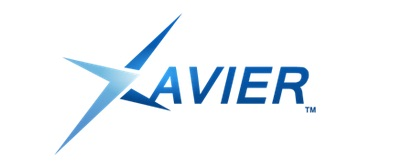
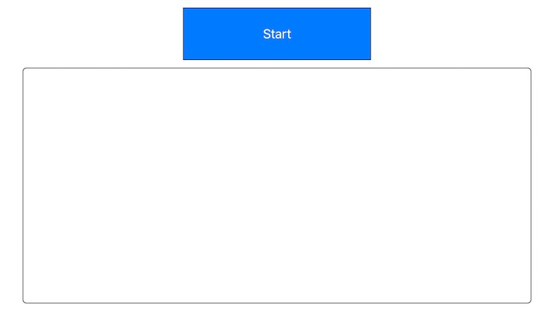
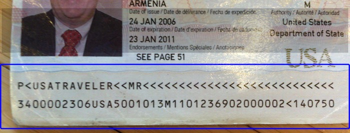
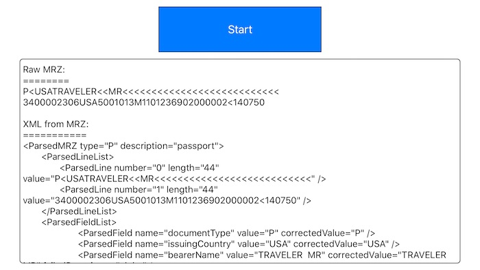
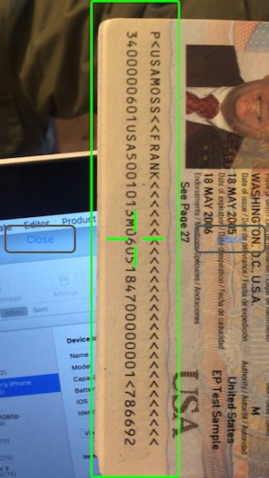

  
  

### Xavier iOS Integration Manual  
 
####For Xavier IOS SDK 1.1, March 2017   
####By Blackshark Tech,  6811 Spout Ln, Fairfax Station, VA 22039   
 
**Description**  

The Xavier SDK contains both Objective-C and Swift demo applications that demonstrate the API calls you can use to interact with the Xavier Library. The Xavier SDK is an IOS framework that enables the developers to integrate the ability to scan International Civil Aviation Organization (ICAO) compliant two-line passport and three-line ID travel documents. Some sample documents that Xavier SDK can process are:
 

* Passport  
* Refugee Travel Document  
* Visa, Resident Alien, Commuter  
* Re-Entry Permit  

The Xavier SDK is capable of scanning the travel document via the native camera to extract all the Machine Readable Zone (MRZ) fields from the travel documents. Xavier SDK performs auto capture when the quality threshold is reached or timeout occurred. The resulting  data are returned as key-value pair elements.  

To integrate the Xavier SDK into your project, you need to include the <b>Xavier.framework</b> and <b>tessdata</b> training folder in your Xcode project (Figure 4). 

The provided demo project was created using <b>Xcode 7.2.1</b> IDE. Please download the XavierTestApplication and follow the instructions below on setting up and running the Xavier SDK demo application in Xcode IDE. The project is configured to compile at iOS 9.  

The Xavier Evaluation SDK has been tested on the iPhone 5 through 6S Plus and iPad Air and iPad Air 2.  

The Xavier Evaluation SDK will require a key and the email address registered to that key to operate.  You may go to the below link below to request for your key:  

&nbsp;&nbsp;&nbsp;&nbsp;&nbsp;&nbsp;&nbsp;&nbsp;&nbsp;&nbsp;&nbsp;&nbsp;&nbsp;&nbsp;&nbsp;[http://www.blacksharktech.com/](http://www.blacksharktech.com/)   

You need to specify an email address to receive the generated key.  There is no obligation to purchase the Xavier SDK.  We invite you to explore and try it out for free.  

The Xavier Evaluation SDK displays a random pop-up screen to indicate that this is an evaluation version. Please contact Blackshark Tech email address sales@blacksharktech.com for a production license version of Xavier  

####Getting the latest Xavier Evaluation SDK from GitHub  

1. Download the XavierTestApplication project. This is a self contained Xavier Evaluation project which includes the Xavier.framework for you to run the demo application on the iPhone.
 
2. Open the XavierTestApplication project using the Xcode IDE and compile the project. To integrate the Xavier.framework into your application, please make sure you have the similar setting as the Xavier Evaluation SDK.  Here are all the Xavier Evaluation SDK settings:
 

&nbsp;&nbsp;&nbsp;&nbsp;&nbsp;&nbsp;&nbsp;&nbsp;**General Setting (Figure 1)**

&nbsp;&nbsp;&nbsp;&nbsp;&nbsp;&nbsp;&nbsp;&nbsp;   
 
&nbsp;&nbsp;&nbsp;&nbsp;&nbsp;&nbsp;&nbsp;&nbsp;**Architectures Setting (Figure 2)**

&nbsp;&nbsp;&nbsp;&nbsp;&nbsp;&nbsp;&nbsp;&nbsp;   
 
&nbsp;&nbsp;&nbsp;&nbsp;&nbsp;&nbsp;&nbsp;&nbsp;**Build Options Setting (Figure 3)**

&nbsp;&nbsp;&nbsp;&nbsp;&nbsp;&nbsp;&nbsp;&nbsp;   
 
&nbsp;&nbsp;&nbsp;&nbsp;&nbsp;&nbsp;&nbsp;&nbsp;**Xavier Framework & tessdata folder highlighted in red (Figure 4)**

&nbsp;&nbsp;&nbsp;&nbsp;&nbsp;&nbsp;&nbsp;&nbsp;   
 
####Running Xavier Evaluation SDK application on the iPhone phone  
1. Connect the iPhone phone to your laptop via the USB connection. 
2.  Before running the Xavier Evaluation SDK demo application from the Xcode IDE, make sure the iPhone you are tesing on is properly provisioned.
 
3. Run Xavier Evaluation application from Xcode IDE.  
4. Once Xavier Evaluation application is running on the iPhone. You should see the following screen:  
5. Click &quot;Start&quot; button to initiate the MRZ capturing process. The capturing screen should display as below:    
6. Xavier is now capable of running in portrait orientation (Figure 11). Refer to the integration section for more details on how to utilzie this mode.

&nbsp;&nbsp;&nbsp;&nbsp;&nbsp;&nbsp;&nbsp;&nbsp;**Xavier Evaluation SDK Application  (Figure 5)**
&nbsp;&nbsp;&nbsp;&nbsp;&nbsp;&nbsp;&nbsp;&nbsp;   

&nbsp;&nbsp;&nbsp;&nbsp;&nbsp;&nbsp;&nbsp;&nbsp;**Two-line MRZ Preview (Figure 6)**

&nbsp;&nbsp;&nbsp;&nbsp;&nbsp;&nbsp;&nbsp;&nbsp;   

&nbsp;&nbsp;&nbsp;&nbsp;&nbsp;&nbsp;&nbsp;&nbsp;**Two-line MRZ in-focus (Figure 7)**

&nbsp;&nbsp;&nbsp;&nbsp;&nbsp;&nbsp;&nbsp;&nbsp;   

&nbsp;&nbsp;&nbsp;&nbsp;&nbsp;&nbsp;&nbsp;&nbsp;**Two-line MRZ Final Result (Figure 8)**

&nbsp;&nbsp;&nbsp;&nbsp;&nbsp;&nbsp;&nbsp;&nbsp;   

 

&nbsp;&nbsp;&nbsp;&nbsp;&nbsp;&nbsp;&nbsp;&nbsp;**Three-line MRZ Preview (Figure 9)**

&nbsp;&nbsp;&nbsp;&nbsp;&nbsp;&nbsp;&nbsp;&nbsp;   

&nbsp;&nbsp;&nbsp;&nbsp;&nbsp;&nbsp;&nbsp;&nbsp;**Three-line MRZ in-focus (Figure 10)**

&nbsp;&nbsp;&nbsp;&nbsp;&nbsp;&nbsp;&nbsp;&nbsp;   

&nbsp;&nbsp;&nbsp;&nbsp;&nbsp;&nbsp;&nbsp;&nbsp;**Three-line MRZ Final Result (Figure 10)**

&nbsp;&nbsp;&nbsp;&nbsp;&nbsp;&nbsp;&nbsp;&nbsp;   

&nbsp;&nbsp;&nbsp;&nbsp;&nbsp;&nbsp;&nbsp;&nbsp;**Xavier in portrait orientation (Figure 11)**  

&nbsp;&nbsp;&nbsp;&nbsp;&nbsp;&nbsp;&nbsp;&nbsp;   

 

6. To capture MRZ data accurately, hold the document as close as possible to the camera and make sure the MRZ lines (either two-line or three-line document) fall within the rectangular box on the phonescreen.   
7. The capturing screen displays a rectangular box in blue color (Figure 6 or Figure 9) when it is not detecting any MRZ lines. The rectangular box turns to green (Figure 7 or Figure 10) with a plus mark when it detects the MRZ lines.   
8. The capturing screen automatically goes away under one of these three conditions:  
    1. When the MRZ lines are successfully captured.  
    2. When timeout has occurred and it returns the MRZ lines to the client application.  Timeout is currently set to 5 seconds. 
    3. When an error occurred and failed to capture MRZ lines.  It returns an error message in the onError callback.   
 
  
####Xavier Library Integration Code
#####1. Property List:
Starting version 1.1, <b>xavier.plist</b> has been introduced as part of the Xavier SDK package. It must be added to any projects utilizing the Xavier framework. 
  The plist contains the following fields: 
i. Email Address: The email one registers with Blackshark Tech to generate the license key 
ii. License Key: The license key obtained from Blackshark Tech to enable Xavier 
iii. Portrait Mode: Specify whether Xavier should be used in portrait mode 
iv. previewing UIColor: Specify the color of the preview box for the Xaveir widget. The value has to be of type UIColor 
v. mrz detected UIColor: Specify the color of the preview box when the target MRZ is detected. The value has to be of type UIColor 
vi. close button text: Specify the display text of the close button on the Xavier widget 
vii. company logo image: Specify the image to be used for the company logo. This is displayed on the top left corner (landscape mode) and top right corner (portrait mode) of the Xavier widget 
viii. company logo width: Specify the width of the logo from (vii) 
ix. company logo height: Specify the height of the logo from (vii) 
x. Maximum MRZ candidates: Specify the maximum number of MRZ candidates that the engine need to create the composite 
xi. OCR Timeout: Specify the maximum duration that the enginge will run  
The plist is used to simplify the Xavier View Controller initialization process
#####2. Starting up Xavier capturing screen (Please see ViewController.m for integration code usage)  
#####There are 2 ways to initialize the Xavier View Controller:
a. Explicitly specify whether the view controller will be initialized in portrait or landscape mode:

	<b>Objective-C:</b>
<pre><code>
    // NOTE: To request License Key, contact Blackshark Tech (www.blacksharktech.com)
    //Portrait mode
    _xavierViewController = [[SCIXavierViewController alloc] init:true];
    /* OR */
    //Landscape mode
    _xavierViewController = [[SCIXavierViewController alloc] init:false];
    _xavierViewController._clientProtocol = self;    
    [self presentViewController:_xavierViewController animated:NO completion:^{
        NSLog(@"Xavier View Controller is started");
    }];
 </code></pre>  
 
 	<b>Swift:</b>
 <pre><code>
    // NOTE: To request License Key, contact Blackshark Tech (www.blacksharktech.com)
    //Portrait mode 
    xavierVC = SCIXavierViewController(true)
    /* OR */
    //Landscape mode 
    xavierVC = SCIXavierViewController(false)
    xavierVC?._clientProtocol = self
    self.presentViewController(xavierVC!, animated: false, completion: {() -> Void in print("Xavier is started")})
 </code></pre>
 
 b. Leave out the orientation info and let the constructor pull that from xavier.plist:
 
	<b>Objective-C:</b>
<pre><code>
    // NOTE: To request License Key, contact Blackshark Tech (www.blacksharktech.com) 
    _xavierViewController = [[SCIXavierViewController alloc] init];
    _xavierViewController._clientProtocol = self;    
    [self presentViewController:_xavierViewController animated:NO completion:^{
        NSLog(@"Xavier View Controller is started");
    }];
 </code></pre>  
 
 	<b>Swift:</b>
 <pre><code>
    // NOTE: To request License Key, contact Blackshark Tech (www.blacksharktech.com)
    xavierVC = SCIXavierViewController()
    xavierVC?._clientProtocol = self
    self.presentViewController(xavierVC!, animated: false, completion: {() -> Void in print("Xavier is started")})
 </code></pre>
 <b>Note</b>: If the approach in (a) is used to initialize the Xavier view controller then it will always overrride the value specified in the plist
#####3. The Xavier client callbacks
<b>Objective-C:</b>  
<pre><code> 
/**
 * onRawMrz - SCIXavierClientProtocol implementation
 */
-(void) <b>onRawMrz</b>: (NSString*) rawMrz
{
    // Raw MRZ lines
} 
/**
 * onMrzCaptureCompleted - SCIXavierClientProtocol implementation
 */
-(void) <b>onMrzCaptureCompleted</b>
{
    // MRZ capture complete event
} 
/**
 * onError - SCIXavierClientProtocol implementation
 */
-(void) <b>onError</b>: (NSString*) errorMessage
{
	// MRZ capturing encountered errors
} 
/**
 * onParsedXmlFromlMrz - SCIXavierClientProtocol implementation
 */
-(void) <b>onParsedXmlFromlMrz</b>: (NSString*) parsedXmFromlMrz
{
	// Parsed MRZ in XML format
} 
/**
 * onMetrics - SCIXavierClientProtocol implementation
 */
-(void) <b>onMetrics</b>: (SCIMetrics*) metrics
{
	// Captured Metrics data for analysis purpose    
}
</code></pre>
**Swift:**
<pre><code>
@objc func **onRawMrz**(rawMrz: String!) -> Void {
	//Raw MRZ lines
} 
@objc func **onParsedXmlFromlMrz**(parsedXmFromlMrz: String!) -> Void {
//MRZ capture complete event 
} 
@objc func onMetrics(metrics: SCIMetrics!) -> Void {
// Captured Metrics data for analysis purpose
} 
@objc func **onMrzCaptureCompleted**() -> Void {
// Parsed MRZ in XML format
} 
@objc func **onError**(errorMessage: String!) -> Void {
// MRZ capturing encountered errors
}
</code></pre>

####XML Tag Description
The “onCapturedMRZ” callback returns the validated and corrected MRZ.  Attributes are used to indicate validation states and corrected field values.
 
A ParsedMRZ XML tag is created when an MRZ is parsed.  The lines of an ParsedMRZ are put into an XML tag called “ParsedLineList”.  Each line is put into a “ParsedLine” XML tag.  These are characters that are recognized by the OCR engine in a raw state.  Each line is delimited by a carriage return or line feed.
 
The document type determines the schema of the MRZ.  Fields are defined by their line and position within each line of the MRZ.  Each field consists of descriptors.
 
* alpha - the field only contains upper case alpha characters
* checkDigit - the field is a number and is a check digit of a field
* futureDate - the field is a date in the future (with the format YYMMDD)
* mandatory - the field must not be blank (“<“)
* numeric - the field is numeric
* pastDate - the field is a date in the past
* set - the field is in a set (i.e. M, F, X - male, female, other)
 
Fields found in each “ParsedLine” are put into “ParsedField” tags.   The “ParsedField” tags have the following attributes:
 
* name - the name of the field.  Some fields can have different names but similar function from other travel documents.
* value - the value of the field from the MRZ
* correctedValue - the corrected value of the field fro the MRZ
* failedDescriptor - this attribute only appears when a descriptor fails when validating the MRZ.  If there are multiple detected failures, a list of them will be created for the attribute value.

####Sample MRZ result data   
The onRawMrz callback receives the raw MRZ lines.   The onParsedXmlFromlMrz callback receives the parsed MRZ elements in XML format. The onMetrics callbacks receives the collected metrics data.

&nbsp;&nbsp;&nbsp;&nbsp;&nbsp;&nbsp;&nbsp;&nbsp;  

####Error Handling  
When an error occurrs, the onError callback will be called.

####Additional Information  
Please feel free to contact us at admin@blacksharktech.com for any questions.

#####Release Notes
 
1.1.0
 
* Added portrait capture mode
* Added support for Apple Tablets.
* Updated to Tesseract 3.03
* Added configuration through Plist
 
1.0.0    
Initial release of Xavier Evaluation SDK  
 
© 2017 Blackshark Tech All Rights Reserved.

