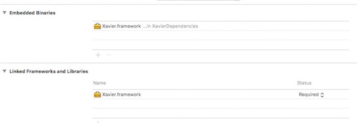
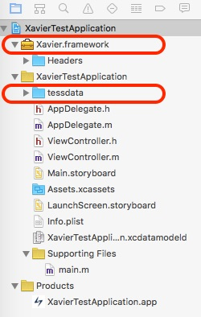
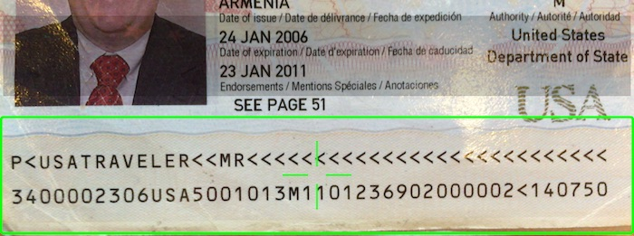
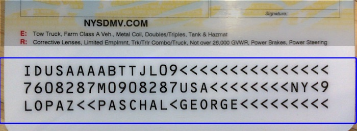
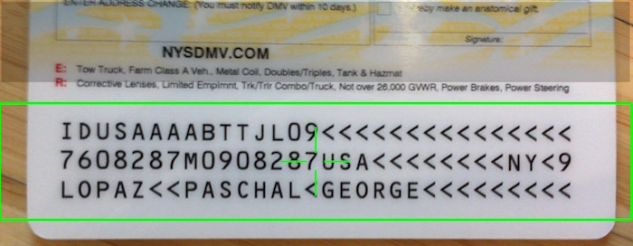

  
  

### Xavier iOS Integration Manual  
 
####For Xavier iOS SDK 1.0, December 2015   
####By SimonComputing Inc.  5350 Shawnee Road, Suite 200  Alexandria, VA 22312    
 
**Description**  

The Xavier SDK contains a demo application that demonstrates the API calls you can use to interact with the Xavier Library. The Xavier SDK is an iOS SDK that enables the developers to integrate the ability to scan International Civil Aviation Organization (ICAO) compliant two-line passport traveldocuments and three-line ID cards. Some sample documents that Xavier SDK can process are:
 

* Passport  
* Refugee Travel Document  
* Visa, Resident Alien, Commuter  
* Re-Entry Permit  

The Xavier SDK is capable of scanning the travel document via the native camera to extract all the Machine Readable Zone (MRZ) fields from the travel documents. Xavier SDK performs auto capture when the quality threshold is reached or timeout occurred. The resulting  data are returned as key-value pair elements.  

To integrate the Xavier SDK into your project, you need the <b>Xavier.framework</b> into your Xcode project. 

The provided demo project was created using <b>Xcode 7.1.1</b> IDE. Please download the XavierTestApplication and follow the instructions below on setting up and running the Xavier SDK demo application in Xcode IDE. The project is configured to compile at iOS 9.  

The Xavier Evaluation SDK has been tested on the iPhone 5 through 6S Plus.  

The Xavier Evaluation SDK will require a key and the email address registered to that key to operate.  You may go to the below link below to request for your key:  

&nbsp;&nbsp;&nbsp;&nbsp;&nbsp;&nbsp;&nbsp;&nbsp;&nbsp;&nbsp;&nbsp;&nbsp;&nbsp;&nbsp;&nbsp;[http://www.simoncomputing.com/main/xavier](http://www.simoncomputing.com/main/xavier)   

You need to specify an email address to receive the generated key.  There is no obligation to purchase the Xavier SDK.  We invite you to explore and try it out for free.  

The Xavier Evaluation SDK displays a random pop-up screen to indicate that this is an evaluation version. Please contact SimonComputing Inc. email address xavier@simoncomputing.com for a production license version of Xavier  

####Getting the latest Xavier Evaluation SDK from GitHub  

1. Download the XavierTestApplication project. This is a self contained Xavier Evaluation project which contains the Xavier.framework for you to run the demo application on the iPhone.
 
2. Open the XavierTestApplication project using the Xcode IDE and compile the project. If you integrate the Xavier.framework into your application, please make sure you have the similar setting as the Xavier Evaluation SDK.  Here are all the Xavier Evaluation SDK settings screenshots:

&nbsp;&nbsp;&nbsp;&nbsp;&nbsp;&nbsp;&nbsp;&nbsp;**General Setting (Figure 1)**

&nbsp;&nbsp;&nbsp;&nbsp;&nbsp;&nbsp;&nbsp;&nbsp;   

&nbsp;&nbsp;&nbsp;&nbsp;&nbsp;&nbsp;&nbsp;&nbsp;**Architectures Setting (Figure 2)**

&nbsp;&nbsp;&nbsp;&nbsp;&nbsp;&nbsp;&nbsp;&nbsp;   

&nbsp;&nbsp;&nbsp;&nbsp;&nbsp;&nbsp;&nbsp;&nbsp;**Build Options Setting (Figure 3)**

&nbsp;&nbsp;&nbsp;&nbsp;&nbsp;&nbsp;&nbsp;&nbsp;   

&nbsp;&nbsp;&nbsp;&nbsp;&nbsp;&nbsp;&nbsp;&nbsp;**Xavier Framework (highlighted in red)**

&nbsp;&nbsp;&nbsp;&nbsp;&nbsp;&nbsp;&nbsp;&nbsp;   

####Running Xavier Evaluation SDK application on the iPhone phone  
1. Connect the iPhone phone to your laptop via the USB connection. 
2.  Before running the Xavier Evaluation SDK demo application from the Xcode IDE, make sure the iPhone you are tesing on is properly provisioned.
 
3. Run Xavier Evaluation application from Xcode IDE.  
4. Once Xavier Evaluation application is running on the iPhone. You should see the following screen:  
5. Click &quot;Start&quot; button to initiate the MRZ capturing process. The capturing screen should display as below:    

&nbsp;&nbsp;&nbsp;&nbsp;&nbsp;&nbsp;&nbsp;&nbsp;**Xavier Evaluation SDK Application  (Figure 5)**
&nbsp;&nbsp;&nbsp;&nbsp;&nbsp;&nbsp;&nbsp;&nbsp;   

&nbsp;&nbsp;&nbsp;&nbsp;&nbsp;&nbsp;&nbsp;&nbsp;**Two-line MRZ Preview (Figure 6)**

&nbsp;&nbsp;&nbsp;&nbsp;&nbsp;&nbsp;&nbsp;&nbsp;   

&nbsp;&nbsp;&nbsp;&nbsp;&nbsp;&nbsp;&nbsp;&nbsp;**Two-line MRZ in-focus (Figure 7)**

&nbsp;&nbsp;&nbsp;&nbsp;&nbsp;&nbsp;&nbsp;&nbsp;   

&nbsp;&nbsp;&nbsp;&nbsp;&nbsp;&nbsp;&nbsp;&nbsp;**Two-line MRZ Final Result (Figure 8)**

&nbsp;&nbsp;&nbsp;&nbsp;&nbsp;&nbsp;&nbsp;&nbsp;   

 

&nbsp;&nbsp;&nbsp;&nbsp;&nbsp;&nbsp;&nbsp;&nbsp;**Three-line MRZ Preview (Figure 9)**

&nbsp;&nbsp;&nbsp;&nbsp;&nbsp;&nbsp;&nbsp;&nbsp;   

&nbsp;&nbsp;&nbsp;&nbsp;&nbsp;&nbsp;&nbsp;&nbsp;**Three-line MRZ in-focus (Figure 10)**

&nbsp;&nbsp;&nbsp;&nbsp;&nbsp;&nbsp;&nbsp;&nbsp;   

&nbsp;&nbsp;&nbsp;&nbsp;&nbsp;&nbsp;&nbsp;&nbsp;**Three-line MRZ Final Result (Figure 10)**

&nbsp;&nbsp;&nbsp;&nbsp;&nbsp;&nbsp;&nbsp;&nbsp;   

 

6. To capture MRZ data accurately, hold the document as close as possible to the camera and make sure the MRZ lines (either two-line or three-line document) fall within the rectangular box on the phonescreen.   
7. The capturing screen displays a rectangular box in blue color (Figure 5 or Figure 8) when it is not detecting any MRZ lines. The rectangular box turns to green (Figure 6 or Figure 9) with a plus mark when it detects the MRZ lines.   
8. The capturing screen automatically goes away under one of these three conditions:  
    1. When the MRZ lines are successfully captured.  
    2. When timeout has occurred and it returns the MRZ lines to the client application.  Timeout is currently set to 5 seconds. 
    3. When an error occurred and failed to capture MRZ lines.  It returns an error message in the onError callback.   
 
  
####Xavier Library Integration Code    
#####1. Starting up Xavier capturing screen (Please see ViewController.m for integration code usage)  
<pre><code>
    // NOTE: Need to contact SimonComputing Inc. (www.SimonComputing.com) for the License Key
    _xavierViewController = [[SCIXavierViewController alloc]  initWithLicenseKey: @"test@hotmail.com"
                                                                   andLicenseKey: @"E1234567890"];
    _xavierViewController._clientProtocol = self;
    
    [self presentViewController:_xavierViewController animated:NO completion:^{
        NSLog(@"Xavier View Controller is started");
    }];   
</code></pre>    

#####2. The Xavier client callbacks   

<pre><code> 
/**
 * onRawMrz - SCIXavierClientProtocol implementation
 */
-(void) <b>onRawMrz</b>: (NSString*) rawMrz
{
    // Raw MRZ lines
}

/**
 * onMrzCaptureCompleted - SCIXavierClientProtocol implementation
 */
-(void) <b>onMrzCaptureCompleted</b>
{
    // MRZ capture complete event
}

/**
 * onError - SCIXavierClientProtocol implementation
 */
-(void) <b>onError</b>: (NSString*) errorMessage
{
	// MRZ capturing encountered errors
}

/**
 * onParsedXmlFromlMrz - SCIXavierClientProtocol implementation
 */
-(void) <b>onParsedXmlFromlMrz</b>: (NSString*) parsedXmFromlMrz
{
	// Parsed MRZ in XML fromat
}

/**
 * onMetrics - SCIXavierClientProtocol implementation
 */
-(void) <b>onMetrics</b>: (SCIMetrics*) metrics
{
	// Captured Metrics data for analysis purpose    
}
</code></pre>  

####Sample MRZ result data   
The onRawMrz callback receives the raw MRZ lines.   The onParsedXmlFromlMrz callback receives the parsed MRZ elements in XML format. The onMetrics callbacks receives the collected metrics data.

&nbsp;&nbsp;&nbsp;&nbsp;&nbsp;&nbsp;&nbsp;&nbsp;  

####Error Handling  
When an error occurrs, the onError callback will be called.

####Additional Information  
Please feel free to contact us at xavier@simoncomputing.com for any questions.

#####Release Notes 
1.0.0    
Initial release of Xavier Evaluation SDK  
 
 
 
© 2015 SimonComputing Inc. All Rights Reserved.

